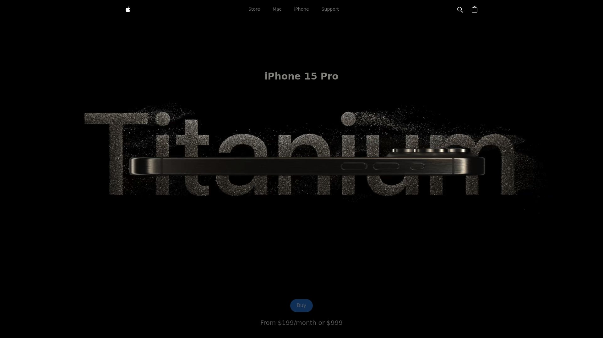

# Apple Website — Learning Project

A polished, experimental front-end built while learning GSAP and three.js. This project uses React + Vite, Tailwind CSS and small custom 3D/animation components to explore interactive UI patterns, 3D model viewing, and performant animations.

## Why this project

I built this to learn and practice:

- GSAP (GreenSock) for advanced, timeline-driven UI animations
- three.js for lightweight, interactive 3D experiences inside the page
- modern React tooling with Vite and Tailwind for fast iteration

The code intentionally focuses on componentized animations and a simple 3D model viewer to practice integration patterns and performance considerations.

## Highlights / Features

- Hero section with animated micro-interactions (GSAP)
- Responsive layout built with Tailwind CSS
- Interactive 3D model/viewer components powered by three.js
- Video carousel and media-rich hero sections
- Small, focused components in `src/components` to study patterns

## Tech stack

- Framework: React (JSX)
- Bundler: Vite
- Styling: Tailwind CSS
- Animations: GSAP
- 3D: three.js
- Optional: other small utilities in `src/utlis`

## Project structure (important files)

- `index.html` — app entry
- `src/main.jsx` — app bootstrap
- `src/App.jsx` — top-level app
- `src/index.css` — Tailwind + global styles
- `src/components/` — UI + 3D components (Hero, ModelView, IPhone, VideoCarousel, etc.)
- `models/` — 3D assets referenced by three.js components
- `public/assets/` — images, videos and other static assets
- `package.json` — scripts & dependencies

## Getting started (local)

Prerequisites: Node.js 16+ (or current LTS) and npm or yarn.

1. Install dependencies

```bash
# using npm
npm install

# or using yarn
yarn
```

2. Start the dev server

```bash
npm run dev
```

3. Open the app

Visit the URL printed by Vite (usually `http://localhost:5173`).

4. Build for production

```bash
npm run build

# Preview the production build locally
npm run preview
```

## Development notes & tips

- The 3D code is intentionally kept simple to focus on learning three.js basics (scene, camera, renderer, simple controls). See `src/components/ModelView.jsx` and `models/` for examples.
- Animations use GSAP timelines. Look for `utlis/animations.js` and GSAP usage inside components such as `Hero.jsx` and `Lights.jsx`.
- Keep an eye on renderer sizes and requestAnimationFrame loops when editing three.js code — unnecessary re-renders can hurt page performance.

## Learning log (what I practiced)

- Setting up and composing GSAP timelines with React lifecycle
- Loading and rendering simple models with three.js and composing them inside React components
- Integrating media (video) with UI transitions
- Responsive design with Tailwind utilities

## Next steps / improvements

- Add lazy-loading for 3D models and code-splitting for heavy components
- Replace any placeholder 3D models with optimized glTF / Draco-compressed assets
- Add keyboard accessibility to interactive components (carousels, controls)
- Add small unit tests for UI logic where feasible

## Credits

Built as a personal learning project. Thanks to the GSAP and three.js communities for excellent docs and examples.

## License

This repo is provided for learning purposes. Feel free to use or adapt the code; include attribution if you reuse significant parts.

---

If you'd like, I can also:

- add screenshots to this README,
- create a short CONTRIBUTING or DEVNOTES file, or
- run a local dev server to capture and document exact URLs and scripts in `package.json`.

Let me know which extras you want and I will add them.
